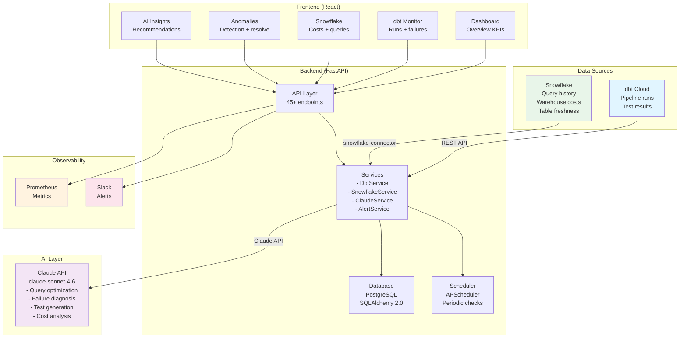
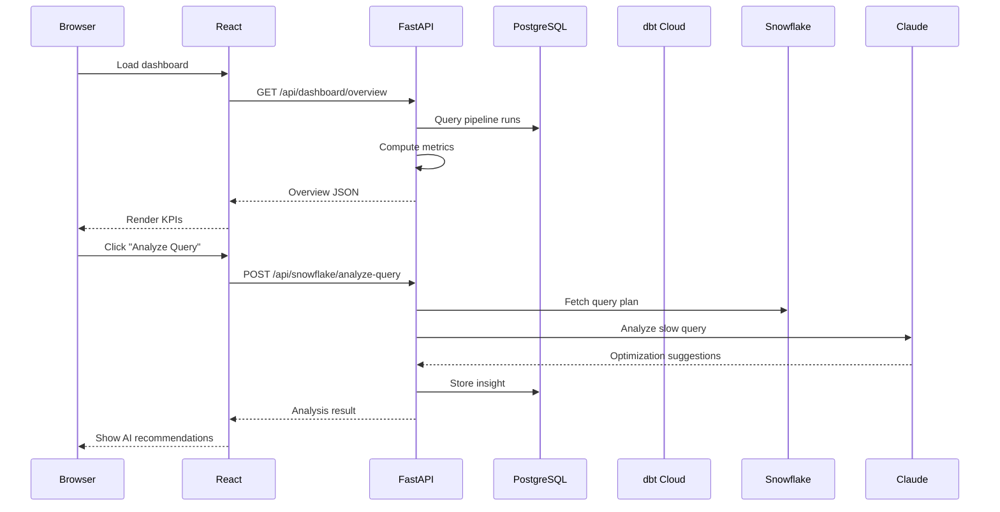
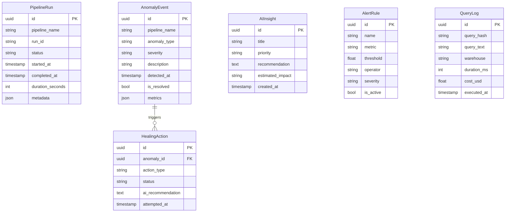
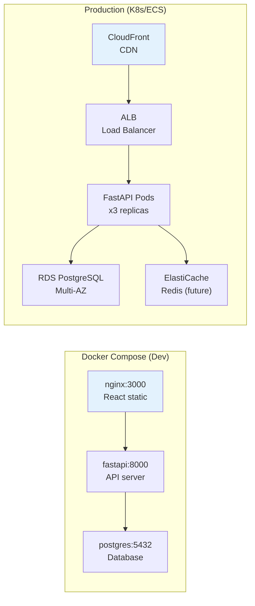

# Data Engineering Observability Platform — Architecture

## System Overview

```mermaid
graph TB
    subgraph "Data Sources"
        A["dbt Cloud<br/>Pipeline runs<br/>Test results"]
        B["Snowflake<br/>Query history<br/>Warehouse costs<br/>Table freshness"]
    end

    subgraph "Backend (FastAPI)"
        C["API Layer<br/>45+ endpoints"]
        D["Services<br/>- DbtService<br/>- SnowflakeService<br/>- ClaudeService<br/>- AlertService"]
        E["Database<br/>PostgreSQL<br/>SQLAlchemy 2.0"]
        F["Scheduler<br/>APScheduler<br/>Periodic checks"]
    end

    subgraph "AI Layer"
        G["Claude API<br/>claude-sonnet-4-6<br/>- Query optimization<br/>- Failure diagnosis<br/>- Test generation<br/>- Cost analysis"]
    end

    subgraph "Observability"
        H["Prometheus<br/>Metrics"]
        I["Slack<br/>Alerts"]
    end

    subgraph "Frontend (React)"
        J["Dashboard<br/>Overview KPIs"]
        K["dbt Monitor<br/>Runs + failures"]
        L["Snowflake<br/>Costs + queries"]
        M["Anomalies<br/>Detection + resolve"]
        N["AI Insights<br/>Recommendations"]
    end

    A -->|REST API| D
    B -->|snowflake-connector| D
    D -->|Claude API| G
    D --> E
    D --> F
    C --> D
    C --> H
    C --> I
    J --> C
    K --> C
    L --> C
    M --> C
    N --> C

    style A fill:#e1f5ff
    style B fill:#e8f5e9
    style G fill:#f3e5f5
    style H fill:#fff3e0
    style I fill:#fce4ec
```

## Request Flow

```mermaid
sequenceDiagram
    participant Browser
    participant React
    participant FastAPI
    participant PostgreSQL
    participant dbt Cloud
    participant Snowflake
    participant Claude

    Browser->>React: Load dashboard
    React->>FastAPI: GET /api/dashboard/overview
    FastAPI->>PostgreSQL: Query pipeline runs
    FastAPI->>FastAPI: Compute metrics
    FastAPI-->>React: Overview JSON
    React-->>Browser: Render KPIs

    Browser->>React: Click "Analyze Query"
    React->>FastAPI: POST /api/snowflake/analyze-query
    FastAPI->>Snowflake: Fetch query plan
    FastAPI->>Claude: Analyze slow query
    Claude-->>FastAPI: Optimization suggestions
    FastAPI->>PostgreSQL: Store insight
    FastAPI-->>React: Analysis result
    React-->>Browser: Show AI recommendations
```

## Data Models

```mermaid
erDiagram
    PipelineRun {
        uuid id PK
        string pipeline_name
        string run_id
        string status
        timestamp started_at
        timestamp completed_at
        int duration_seconds
        json metadata
    }

    AnomalyEvent {
        uuid id PK
        string pipeline_name
        string anomaly_type
        string severity
        string description
        timestamp detected_at
        bool is_resolved
        json metrics
    }

    HealingAction {
        uuid id PK
        uuid anomaly_id FK
        string action_type
        string status
        text ai_recommendation
        timestamp attempted_at
    }

    AIInsight {
        uuid id PK
        string title
        string priority
        text recommendation
        string estimated_impact
        timestamp created_at
    }

    AlertRule {
        uuid id PK
        string name
        string metric
        float threshold
        string operator
        string severity
        bool is_active
    }

    QueryLog {
        uuid id PK
        string query_hash
        string query_text
        string warehouse
        int duration_ms
        float cost_usd
        timestamp executed_at
    }

    AnomalyEvent ||--o{ HealingAction : "triggers"
```

## Deployment Architecture

```mermaid
graph LR
    subgraph "Docker Compose (Dev)"
        A["nginx:3000<br/>React static"]
        B["fastapi:8000<br/>API server"]
        C["postgres:5432<br/>Database"]
    end

    subgraph "Production (K8s/ECS)"
        D["CloudFront<br/>CDN"]
        E["ALB<br/>Load Balancer"]
        F["FastAPI Pods<br/>x3 replicas"]
        G["RDS PostgreSQL<br/>Multi-AZ"]
        H["ElastiCache<br/>Redis (future)"]
    end

    A --> B
    B --> C
    D --> E
    E --> F
    F --> G
    F --> H

    style A fill:#e3f2fd
    style D fill:#e3f2fd
```
